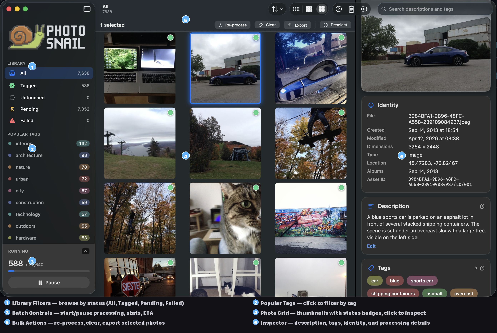

# PhotoSnail

**Local-first AI that describes and tags every photo in your macOS Photos library.** No cloud, no upload — your photos never leave your Mac.

PhotoSnail runs a vision-language model on your machine, generates a 2–3 sentence description plus 5–15 tags for each photo, and writes the result back to the asset's `description` field in Photos.app. iCloud syncs the description to your other devices, so the new metadata becomes searchable in Photos and Spotlight everywhere.



## Why "Snail"?

Originally because the default pipeline — gemma4:31b via Ollama — takes ~65 seconds per photo on Apple Silicon, and a 10,000-photo library needs about a week of background processing. The trade-off is quality: descriptions are accurate, specific, and actually useful — not the generic "outdoor scene with people" you get from off-the-shelf classifiers.

As of **v0.1.3**, PhotoSnail also supports a **6× faster** path via Qwen3.6-35B (MoE) through a locally-hosted OpenAI-compatible server (mlx-vlm / LM Studio / vLLM). A 10,000-photo library now finishes in ~1–2 days instead of a week, with richer brand and landmark recognition from a prompt that was tuned across 20 iterations against a 12-photo benchmark. The "slow on purpose" premise still holds for the Ollama default; Qwen is there if you want the speed and can run a second server. See [Performance](#performance) below.

## Features

- **Fully on-device by default.** Apple Vision + a local LLM via [Ollama](https://ollama.com) or a local OpenAI-compatible server (mlx-vlm / LM Studio / vLLM). No API keys, no rate limits, no privacy concessions. Nothing leaves your Mac except the description iCloud syncs to your other Apple devices.
- **Two provider paths.** Pick the one that fits your hardware: Ollama (gemma4:31b baseline, privacy-first, slower) or OpenAI-compatible (Qwen3.6-35B via mlx-vlm, ~6× faster, needs a second locally-hosted server). Switch in Settings; no config reshuffle.
- **Tuned prompt per model family.** Qwen models get a v20 prompt tuned across 20 documented iterations for specificity, false-positive suppression, and brand/landmark recognition. Gemma gets the original Phase D–tuned prompt. Swap models and the right default follows.
- **Specific descriptions.** "A blue BMW M brake caliper mounted on a silver brake rotor" — not "a car part."
- **Searchable tags.** 5–10 lowercase tags per photo, including brands and named objects when visible. Tags are stored with spaces (`party hat`, not `partyhat`) so Photos.app's word-level search matches both halves.
- **Writes back to Photos.app.** Uses AppleScript to populate the `description` field — iCloud syncs it to your iPhone, iPad, and Spotlight.
- **Preserves your existing descriptions.** If a photo already has a caption you wrote, PhotoSnail keeps it and appends its own description after a separator. Only overwrites freely when the existing text was written by PhotoSnail (sentinel detection).
- **Explicit queue semantics.** Queue starts empty on first launch. Add photos via "Add all unprocessed to queue" or by selecting and adding. **Process now** runs a single selected photo and stops — no surprise full-library batches.
- **Doesn't hog your Mac.** Lowers Ollama's process priority while a batch runs so the browser, editor, and other apps stay responsive. Optional **Auto-start when Mac is locked** runs the queue only while you're away.
- **Resilient.** SQLite-backed queue survives restarts, sleep/wake, and crashes. Re-running on a processed library is a no-op.
- **Provider preflight at startup.** GUI surfaces a blocking sheet with copy-paste fix commands when Ollama is unreachable or the configured model is missing. CLI exits 2 with the same fixes printed.
- **Configurable endpoints.** Ollama defaults to `localhost:11434`; OpenAI-compatible defaults to the last URL you configured. Both support remote instances, HTTPS proxies, and Bearer / Basic / custom-header auth.
- **Per-model sentinels.** Switch models and the tool proposes a matching sentinel (`ai:<family>-v1`) so re-runs across models stay distinguishable, or keep the existing one if you'd rather mix. Each model family keeps its own prompt, sentinel version, and prompt language — switching back to a previous model restores its setup.
- **Editable prompt.** Tweak the instruction sent to the LLM right from Settings. Changing the prompt automatically bumps the sentinel version so new results stay distinguishable from old ones, and offers to requeue previously-processed photos.
- **8 languages, in-place.** UI switches at runtime between English, French, Spanish, German, Portuguese, Japanese, Simplified Chinese, and Korean — no restart. A language change can also re-point the prompt and queue existing descriptions for translation via a fast text-only pass.
- **Two interfaces.** A SwiftUI dashboard with live photo preview, pause/resume, settings sheet, and a failure inspector — plus a CLI for headless / scripted runs.

## How it works

```
PHAsset (from Photos.app)
  ↓
Downsize to 1024 px JPEG (CGImageSource thumbnail, EXIF baked in)
  ↓
[parallel signals]
  ├─ Apple Vision    classify + animals + faces + OCR   (~1 s)
  └─ Local LLM       prompt + image → description + tags
                       gemma4:31b via Ollama            (~60 s)
                       or Qwen3.6-35B via mlx-vlm       (~10 s)
  ↓
Tag merge          LLM tags + LLM-confirmed OCR rescue
  ↓
Write back         description field via AppleScript
  ↓
Sentinel marker    so re-runs skip processed photos
```

The pipeline runs Apple Vision as a *side channel*: its findings are not injected into the LLM prompt (that was tested and rejected — see [`CLAUDE.md`](CLAUDE.md) for the rationale). Vision is used only for OCR text rescue and structured metadata; the LLM describes the photo from the bare image alone.

PhotoSnail supports two interchangeable LLM providers:

- **Ollama** — the privacy-first default. Ships with gemma4:31b tuned during Phase D (2026-04-07); has been production-used against a 39k-photo library.
- **OpenAI-compatible** — intended for **locally-hosted** servers (mlx-vlm, LM Studio, vLLM). Tuned for Qwen3.6-35B (MoE) with the v20 prompt from the 2026-04-18 research batch. See [`sample/PROMPT_RESEARCH.md`](sample/PROMPT_RESEARCH.md) for the research record and [`sample/MODEL_COMPARISON.md`](sample/MODEL_COMPARISON.md) for the 20-iteration benchmark.

Switch providers in Settings or via `--provider ollama|openai` on the CLI. Each model family (`gemma4`, `qwen3-6`, …) keeps its own prompt, sentinel version, and prompt language, so swapping between them doesn't trash your tuning.

## Requirements

- **macOS 14** (Sonoma) or later, Apple Silicon recommended
- **Swift 5.9+** (Xcode 15 or the Swift toolchain)
- **A local inference server** — either Ollama or an OpenAI-compatible server (mlx-vlm, LM Studio, vLLM). See [Install](#install) for setup.

## Install

### 1. Set up a local inference server

PhotoSnail needs a vision-capable LLM running locally. Pick one of the two supported paths:

#### Option A — Ollama + gemma4:31b (privacy-first default)

1. Install [Ollama](https://ollama.com) — download the macOS app from their site.
2. Launch Ollama (it runs in the menu bar).
3. Pull the recommended model:
   ```bash
   ollama pull gemma4:31b
   ```
   This downloads ~19 GB. Smaller models like `gemma4:latest` (~9.6 GB) are faster but produce lower-quality descriptions.

#### Option B — mlx-vlm + Qwen3.6-35B (faster, more specific)

Recommended if you have 48 GB+ of unified memory and want the ~6× speedup and better brand/landmark recognition.

1. Install [mlx-vlm](https://github.com/Blaizzy/mlx-vlm):
   ```bash
   pip install mlx-vlm
   ```
   (Also works with [LM Studio](https://lmstudio.ai/) or [vLLM](https://github.com/vllm-project/vllm) — anything that speaks the OpenAI `/v1/chat/completions` API with multimodal messages.)
2. Start the server with Qwen3.6-35B-A3B-4bit:
   ```bash
   mlx_vlm.server --model mlx-community/Qwen3.6-35B-A3B-4bit --port 9090
   ```
   First run downloads the model (~18 GB) from Hugging Face.
3. In PhotoSnail Settings, switch the provider to **OpenAI-compatible** and point at `http://localhost:9090/v1` (or your server's URL).

You can run both servers simultaneously and switch providers in Settings as often as you like — each model family keeps its own prompt and sentinel.

### 2. Install PhotoSnail

PhotoSnail is **not signed with an Apple Developer ID** (I chose not to pay Apple's $99/year fee for this personal project), so macOS Gatekeeper will flag it as "damaged" on first launch. The release zip includes `install.sh` to handle that for you.

**Recommended — run the installer:**

1. Download the latest `PhotoSnail-vX.Y.Z-arm64.zip` from the [latest release](https://github.com/LaurentPointCa/photo-snail/releases/latest)
2. Unzip the archive
3. Open Terminal in the unzipped folder and run:
   ```bash
   ./install.sh
   ```
   This strips the macOS quarantine flag, copies `PhotoSnail.app` to `/Applications`, and launches it.
4. Grant Photos access when prompted.

**Manual install** (if you'd rather not run the script):

1. Unzip the archive
2. Drag `PhotoSnail.app` to `/Applications`
3. In Terminal, strip the quarantine flag:
   ```bash
   xattr -cr /Applications/PhotoSnail.app
   ```
4. Double-click the app to launch. Grant Photos access when prompted.

> Note: macOS's old "right-click → Open" workaround stopped working on recent macOS versions for apps downloaded through Chrome, so the `xattr` step is now required regardless of how you install.

## Build from source

```bash
swift build -c release
```

Three binaries land in `.build/release/`:

| Binary | Purpose |
|---|---|
| `photo-snail-cli` | Process individual image files (HEIC/JPEG/PNG). Useful for testing the pipeline on a single photo. |
| `photo-snail-app` | Headless CLI that processes your full macOS Photos library end-to-end. |
| `photo-snail-gui` | SwiftUI dashboard. Live preview, stats, pause/resume, failure inspector. |

To package the GUI as a `.app` bundle:

```bash
./bundle-gui.sh
open .build/release/PhotoSnail.app

# Optional: install to /Applications
cp -R .build/release/PhotoSnail.app /Applications/
```

## Usage

### GUI

```bash
./bundle-gui.sh
open .build/release/PhotoSnail.app
```

On first launch the app does an Ollama preflight check; if Ollama isn't running or the configured model isn't pulled, you get a blocking sheet with the exact `brew install` / `ollama pull` commands and a one-click **Start Ollama** button.

The queue is empty by default. Two ways to fill it:

- **Add all unprocessed to queue** (header button, visible on the All and Untouched library views) — enumerates your library, runs the sentinel bootstrap to skip already-processed photos, and queues the rest.
- **Add to queue** (selection action, when you've selected one or more photos) — adds just those photos. If they're already processed, this re-queues them.

Then click **Start Queue**. Grant Photos access when prompted (`System Settings > Privacy & Security > Photos`). The dashboard shows the current photo, the most recently completed photo with its description and tags, throughput, ETA, and any failures.

Other actions worth knowing:

- **Process now** — single-selection action. Runs that one photo (jumping ahead of anything pending) and pauses. No surprise full-batch start.
- **Pause** — flips to a disabled "Waiting to finish…" label until the in-flight photo completes, then transitions to fully paused. Click again to resume.
- **Auto-start when Mac is locked** — toggle below the primary button. When on, the queue starts on screen lock and pauses on unlock. Useful for desktops left running.
- **Queue view** — sidebar filter that shows only pending photos. The selection action becomes **Remove from queue**, and a **Clear queue** button appears in the header.

While processing, PhotoSnail renices the Ollama daemon to keep your other apps responsive. Closing the window does not stop processing — quit from the menu bar to fully exit.

### CLI — single image

```bash
.build/release/photo-snail-cli /path/to/photo.heic

# JSON output
.build/release/photo-snail-cli --json /path/to/photo.heic

# Use a different Ollama model
.build/release/photo-snail-cli --model gemma4:latest /path/to/photo.heic

# Compare prompting modes
.build/release/photo-snail-cli --bare /path/to/photo.heic     # no Vision pre-pass
.build/release/photo-snail-cli --hybrid /path/to/photo.heic   # Vision injected into prompt (slower)
```

### CLI — full Photos library

```bash
# List the 10 most recent assets (sanity check)
.build/release/photo-snail-app --list 10

# Process the entire library
.build/release/photo-snail-app

# Dry-run: full pipeline, no Photos.app write-back, no queue mutation.
# Safe to run on a real queue — it leaves every row exactly as it was.
.build/release/photo-snail-app --dry-run

# Limit to N photos (for testing)
.build/release/photo-snail-app --limit 5
```

The first run requests Photos and Automation permissions. The queue persists at `~/Library/Application Support/photo-snail/queue.sqlite` — you can interrupt and resume freely.

### CLI — picking a provider, model, and endpoint

```bash
# List models available from the current provider (current marked with *)
.build/release/photo-snail-app --list-models

# Probe the current provider's endpoint
.build/release/photo-snail-app --api-test     # provider-agnostic
.build/release/photo-snail-app --ollama-test  # legacy alias

# Switch provider
.build/release/photo-snail-app --provider ollama
.build/release/photo-snail-app --provider openai    # OpenAI-compatible path

# Switch to a different model tag of the same family — silent (sentinel unchanged)
.build/release/photo-snail-app --model gemma4:latest

# Switch to a different model family — REQUIRES an explicit sentinel choice
.build/release/photo-snail-app --model llava:13b --sentinel ai:llava-v1
.build/release/photo-snail-app --model llava:13b --keep-sentinel    # mix under one sentinel

# Point at a remote / proxied Ollama
.build/release/photo-snail-app --ollama-url https://ollama.my.lan
.build/release/photo-snail-app --ollama-url https://ollama.my.lan --ollama-key sk-...

# Point at an OpenAI-compatible server (local or remote)
.build/release/photo-snail-app --provider openai --openai-url http://localhost:9090/v1
.build/release/photo-snail-app --provider openai --openai-url http://localhost:9090/v1 \
    --model mlx-community/Qwen3.6-35B-A3B-4bit --sentinel ai:qwen36_4b-v20

# Custom auth headers (Basic, X-API-Key, etc.)
.build/release/photo-snail-app --ollama-header "X-API-Key=..."
.build/release/photo-snail-app --openai-header "Authorization=Basic dXNlcjpwYXNz"

# Avoid persisting the API key to disk — env var takes precedence at runtime
PHOTO_SNAIL_OLLAMA_API_KEY=sk-... .build/release/photo-snail-app
PHOTO_SNAIL_OPENAI_API_KEY=sk-... .build/release/photo-snail-app --provider openai
```

Settings persist to `~/Library/Application Support/photo-snail/settings.json` (file mode `0600`). The API key is stored in plain text there as a deliberate tradeoff — set the `PHOTO_SNAIL_OLLAMA_API_KEY` environment variable instead if you'd rather not persist it. The GUI exposes the same settings via a gear icon in the toolbar.

A model switch that crosses the model family boundary is rejected with exit code `2` and a clear error unless you pass `--sentinel` or `--keep-sentinel` — this prevents a multi-day batch from silently flipping which sentinel is being written into your photos.

## Performance

### Speed

Measured on an Apple-silicon MacBook Pro, 1024 px downsized JPEGs, side-channel Vision, steady state (warm model):

| Provider | Model | Per photo | 1,000 photos | 10,000 photos |
|---|---|---|---|---|
| Ollama | `gemma4:31b` (dense) | **~65 s** | ~18 hours | ~7.5 days |
| OpenAI-compatible | `Qwen3.6-35B-A3B-4bit` via mlx-vlm (MoE, 3B active) | **~10 s** | ~2.8 hours | ~28 hours |

Qwen is ~**6× faster** end-to-end. The gap comes from two compounding factors: mlx-vlm is optimized for Apple Silicon vs. Ollama's llama.cpp path, and the MoE architecture activates only ~3B of the 35B total parameters per token, so per-token cost is much lower than a dense 31B model.

Variance is real for both providers (0.5–4 tokens/sec depending on thermals and concurrent load). Runs are checkpointed per photo, so you can stop and restart without losing progress.

### Accuracy

Measured on a 12-photo benchmark that tests birthday/cake recognition, false-positive suppression (outdoor ≠ hiking, green+red ≠ christmas), brand identification (BMW M, Dyson), and landmark naming (London, Bucharest). Full per-iteration outputs in [`sample/MODEL_COMPARISON.md`](sample/MODEL_COMPARISON.md); research methodology in [`sample/PROMPT_RESEARCH.md`](sample/PROMPT_RESEARCH.md).

| Provider + model + prompt | Criteria hit (of 14) | Headline wins | Model-level weaknesses |
|---|---|---|---|
| Ollama + `gemma4:31b` + Phase D default prompt | 6 / 14 | Conservative; color perception usually right; generic-but-safe tags | Misses brands (BMW M, Dyson), misses landmarks (London, Bucharest), generic "vehicle"/"appliance"-style object naming |
| OpenAI-compatible + `Qwen3.6-35B` + v20 prompt | **12 / 14** | Names brands when visible; identifies landmarks (London, Bucharest, Arcul de Triumf); suppresses category false positives cleanly | Color hallucination on some photos (red vs orange sweatshirt, gingham mis-read as "red sleeves") — 4-bit MoE quantization artefact on fine color perception |

**Honest summary**: Qwen + v20 is more specific and more searchable on about half the benchmark; gemma4 is more conservative and better on fine color detail. For a personal photo library you mostly search by event, object, and place, Qwen's wins (birthday/travel/brand recognition) are where the practical search value lives. For archival cataloging where color fidelity matters more, gemma4's caution is an advantage.

### Hardware recommendations

- **Ollama path** (gemma4:31b): 32 GB+ unified memory recommended. The model is ~19 GB on disk and runs comfortably on an M1 Pro / M2 Pro / M3 Pro or better.
- **OpenAI-compatible path** (Qwen3.6-35B via mlx-vlm): 48 GB+ unified memory recommended. The 4-bit MLX quant is ~18 GB, and mlx-vlm benefits from the extra memory headroom when paging the MoE experts.

You can run both servers simultaneously on one Mac and switch providers in Settings without stopping a batch (the in-flight photo completes under the old provider, the next one picks up the new one).

## Privacy

PhotoSnail is designed to be a privacy maximalist's photo tagger:

- **No network calls beyond the LLM endpoint you configure.** Default is `localhost:11434` (Ollama). The OpenAI-compatible path is intended for **locally-hosted** servers (mlx-vlm on your Mac, LM Studio, vLLM on a LAN machine) — the Settings sheet shows a persistent banner reminding you of this and PhotoSnail will never auto-point at `api.openai.com`. The pipeline does not phone home, does not upload images to any third party, does not log telemetry.
- **No cloud APIs** in the default path. Cloud vision-LLMs were considered and rejected as the default — see [`CLAUDE.md`](CLAUDE.md) for the rationale.
- **The only thing leaving your Mac** is the description text iCloud syncs to your other Apple devices via the normal Photos sync.

Verify yourself: the binary makes no outbound connections except to the LLM endpoint you configure, and there's no analytics SDK linked anywhere.

## Project status

Phases A–M complete (current release: **v0.1.3**):

- A. Project plan
- B. Hybrid pipeline scaffold
- C. Validation against test photos
- D. Quality assessment (20-photo sample, 14/20 fully accurate)
- E. SQLite queue + resilience
- F. PhotoKit integration + AppleScript write-back
- G. SwiftUI GUI
- H. Deferred (mid-batch quality review showed no weak-output cluster to rescue)
- I. Visual rehaul — 3-column library browser, inspector, design system
- J. UI polish — bug fixes, UX improvements, log window, About box
- K. Custom prompt editor, 8-language runtime localization, translation pipeline
- L. (v0.1.2) External-tester feedback batch — empty-queue default, Add to Queue / Process now, Remove/Clear queue actions, description preservation, Ollama preflight + Start Ollama button, auto-start when locked, Ollama priority lowered during batches, naming + label cleanup, full 8-locale translation sweep
- M. (v0.1.3) OpenAI-compatible provider path (Qwen3.6-35B via mlx-vlm), per-model-family configs (`modelConfigs` keyed by short family), short-family sentinels that strip org/quant/size suffixes, Qwen-tuned v20 default prompt (20-iteration research batch documented in `sample/MODEL_COMPARISON.md` + `sample/PROMPT_RESEARCH.md`), JSON-aware CaptionParser, lock-watcher auto-resume fix.

The CLI and GUI are in production use against the author's full library. See [`TODO.md`](TODO.md) for the phased plan and the parked items under "Potential future improvements".

## Sample images

The `sample/` directory is gitignored. Drop your own `.heic`, `.jpg`, or `.png` files there to test the pipeline locally:

```bash
.build/release/photo-snail-cli sample/IMG_0611.HEIC
```

## Documentation

- [`CLAUDE.md`](CLAUDE.md) — full architecture, design decisions, and gotchas. Read this before making changes.
- [`TODO.md`](TODO.md) — phased plan and progress notes.

## License

MIT — see [`LICENSE`](LICENSE).
